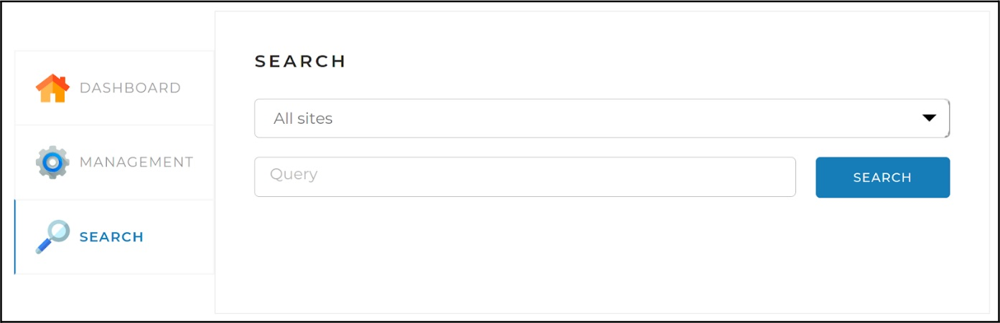

# Search Engine Project


This is a search engine project developed in Java and using various libraries and frameworks. The project is designed to index a limited amount of sites including all their web pages and provide a relevant search functionality.

## Technologies Used

* Java
* Spring Framework
* Spring Boot
* Spring Data JPA
* Spring MVC
* PostgreSQL
* Jsoup
* Lombok
* HtmlCleaner
* Log4j 2
* Thymeleaf
* Apache Lucene Morphology
* Maven

## Installation
To run this application on a local machine, you will need to have the following software and dependencies installed:
* Java 11
* Maven
* PostgreSQL

Once you have the required software installed, follow these steps:

Clone the repository to your local machine:
```bash
$ git clone https://github.com/stradivari1390/SearchEngine.git
```

Create a new PostgreSQL database search_engine for the application.

Configure the database connection details in the application.yaml file.

Run the following command in the project root directory to build the project:
```java
mvn clean package
```
Run the following command to start the application:
```java
-jar target/SearchEngine-1.0-SNAPSHOT.jar
```

## Configuration
The application can be configured by modifying the application.yaml file. Here are the important configuration options:

**indexing-settings:** This section contains a list of sites to index. Each site must have a URL and a name.

**batchsize:** The number of items to process in a batch.

**config:** This section contains configuration options for the web crawler, such as the user agent and referrer.

**server:** The port number that the application will run on.

**spring:** Configuration options for Spring, such as the view templates and data source.

**logging:** Configuration options for logging.

You will need to configure the database connection details in the application.yaml file. The following properties should be set:
* driverClassName
* url
* username
* password

## Endpoints
### Indexing Controller
* `GET /api/startIndexing`: starts the indexing process.
* `GET /api/stopIndexing`: stops the indexing process.
* `POST /api/indexPage?url={url}`: indexes a single page.

**Responses**

IndexResponse: Returns a JSON object with a result field indicating whether the operation was successful.

ErrorResponse: Returns a JSON object with an error field describing the error.
### Searching Controller
* `GET /api/search?query={query}&site={siteUrl}&offset={offset}&limit={limit}`: searches for pages that match the query string.

**Responses**

SearchResponse: Returns a JSON object with a result field indicating whether the search was successful and a data field containing an array of search results.

ErrorResponse: Returns a JSON object with an error field describing the error.
### Statistic Controller
* `GET /api/statistics`: returns statistics on the indexed sites.

**Responses**

StatisticsResponse: Returns a JSON object with a result field indicating whether the statistics were retrieved successfully and a statistics field containing an array of site statistics.

ErrorResponse: Returns a JSON object with an error field describing the error.

## In-browser usage

The web interface (frontend component) of the project to which you can gain access through "**http://localhost:<port_you_have_set_in_config>/**" is a single web page with three tabs:

### Dashboard
This tab opens by default. It displays general statistics for all sites, as well as detailed statistics and status for each of the sites (statistics obtained by querying /api/statistics).


### Control
This tab contains search engine management tools - starting and stopping full indexing (re-indexing), as well as the ability to add (update) a separate page using the link:


### Search
This page is for testing the search engine. It contains a search field, a drop-down list with a choice of a site for search, and when you click on the "Find" button, search results are displayed (by the /api/search API request):



All information in bookmarks is loaded as source documents to API applications. When registering, requests are also sent.

After exiting, you may optimize disk space usage by freeing up storage occupied by the SQL binary logs and pagefile.sys.

## Contributors
The project was developed by __Stanislav Romanov__. If you'd like to contribute to the project, please feel free to submit a pull request.

## License
  
This application makes use of the Lucene open-source library, which is subject to the Apache Software License 2.0.
More information about Lucene can be found at http://lucene.apache.org.