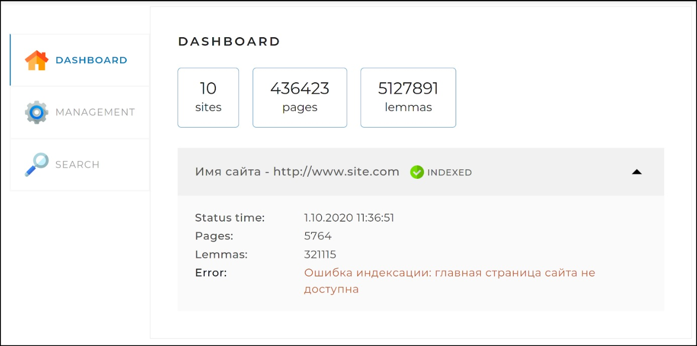
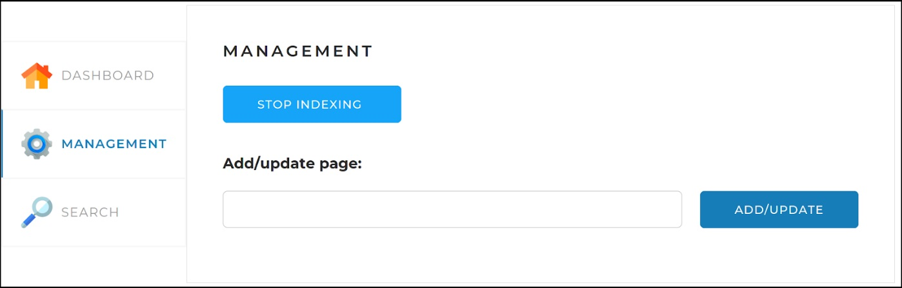

# Search Engine Project


This is a search engine project developed in Java and using various libraries and frameworks. The project is designed to index a limited amount of sites including all their web pages and provide a relevant search functionality.
> *Currently, the engine is able to process sites that contain non-scripted link elements. We are currently working on developing an algorithm to bypass more complex, scripted sites.*

## Technologies Used

* Java
* Spring Framework
* Spring Boot
* Spring Data JPA
* Spring MVC
* PostgreSQL
* Jsoup
* Lombok
* HtmlCleaner
* Log4j 2
* Thymeleaf
* Apache Lucene Morphology
* Maven

## Installation
To run this application on a local machine, you will need to have the following software and dependencies installed:
* Java 11
* Maven
* PostgreSQL

Once you have the required software installed, follow these steps:

Clone the repository to your local machine:
```bash
$ git clone https://github.com/stradivari1390/SearchEngine.git
```

Create a new PostgreSQL database search_engine for the application.

Configure the database connection details in the application.yaml file.

Run the following command in the project root directory to build the project:
```java
mvn clean package
```
Run the following command to start the application:
```java
-jar target/SearchEngine-1.0-SNAPSHOT.jar
```

## Configuration
The application can be configured by modifying the application.yaml file. Here are the important configuration options:

**indexing-settings:** This section contains a list of sites to index. Each site must have a URL (without "www") and a name.

**sql.init.mode** Set "never", if you don't want to create schema manually, turn to always before first run.

> Additionally you can use docker image of postgres. **Instructions are below.**

**batchsize:** The number of items to process in a batch.

**config:** This section contains configuration options for the web crawler, such as the user agent and referrer.

**server:** The port number that the application will run on.

**spring:** Configuration options for Spring, such as the view templates and data source.

**logging:** Configuration options for logging.

You will need to configure the database connection details in the application.yaml file. The following properties should be set:
* driverClassName
* url
* username
* password

### Docker-postgres
To raise a PostgreSQL database through Docker, you can follow these steps:

- Make sure that Docker is installed on your system. You can download and install Docker from the official website: https://www.docker.com/get-started

- Pull the PostgreSQL Docker image from the Docker Hub repository by running the following command in your terminal or command prompt:
```
docker pull postgres
```
- Once the image is downloaded, you can create a new container by running the following command:
```
docker run --name my-postgres -e POSTGRES_PASSWORD=mysecretpassword -d -p 5432:5432 search_engine
```
This command creates a new container named "my-postgres" using the PostgreSQL image, sets the password for the default "postgres" user to "mysecretpassword", and maps the container's port 5432 to the host system's port 5432. You can change the container name and the password to your liking.
- After running the command, you can check the status of your container by running:
```
docker ps
```
This command will list all the running containers on your system. You should see the "my-postgres" container listed.
- Finally, you can connect to the PostgreSQL database from your IDE or command line tool using the following connection details:
```
Host: localhost
Port: 5432
Database: search_engine
User: postgres
Password: mytopsecretpassword
```
#### If you have Docker plugin
in IDE (IntelliJ IDEA for example), you can follow these steps:

- Open project in IntelliJ IDEA and make sure the Docker plugin is installed and enabled. You can check this by going to Settings/Preferences > Plugins and searching for "Docker" (you can find it there and install if it's not). Make sure that Docker is installed on your system as well.
- Add Run configuration and choose docker there.
- In the Add Docker Configuration dialog, select Docker Compose as the configuration type.
- In the Compose file field, specify the path to your docker-compose.yml file. This file should contain the configuration for your PostgreSQL database, such as the version, port number, and environment variables. There is docker-compose.yml in my project, in resources package. You should change password (image version, username if needed).
- Click on the Run button to start the Docker container and raise the PostgreSQL database. You should see the logs in the Docker tool window in service tab below.
- Once the container is running, you can also connect to the PostgreSQL database using a database client such as pgAdmin or DataGrip as well. You can find the hostname, port number, username, and password in the docker-compose.yml file.

That's it! You should now have a running PostgreSQL database in Docker that you can use for testing local search engine.

## Endpoints
### Indexing Controller
* `GET /api/startIndexing`: starts the indexing process.
* `GET /api/stopIndexing`: stops the indexing process.
* `POST /api/indexPage?url={url}`: indexes a single page.

**Responses**

IndexResponse: Returns a JSON object with a result field indicating whether the operation was successful.

ErrorResponse: Returns a JSON object with an error field describing the error.
### Searching Controller
* `GET /api/search?query={query}&site={siteUrl}&offset={offset}&limit={limit}`: searches for pages that match the query string.

**Responses**

SearchResponse: Returns a JSON object with a result field indicating whether the search was successful and a data field containing an array of search results.

ErrorResponse: Returns a JSON object with an error field describing the error.
### Statistic Controller
* `GET /api/statistics`: returns statistics on the indexed sites.

**Responses**

StatisticsResponse: Returns a JSON object with a result field indicating whether the statistics were retrieved successfully and a statistics field containing an array of site statistics.

ErrorResponse: Returns a JSON object with an error field describing the error.

## In-browser usage

The web interface (frontend component) of the project to which you can gain access through "**http://localhost:8080/**" (port is configurable) is a single web page with three tabs:

### Dashboard
This tab opens by default. It displays general statistics for all sites, as well as detailed statistics and status for each of the sites (statistics obtained by querying /api/statistics).



### Control
This tab contains search engine management tools - starting and stopping full indexing (re-indexing), as well as the ability to add (update) a separate page using the link:



### Search
This page is for testing the search engine. It contains a search field, a drop-down list with a choice of a site for search, and when you click on the "Find" button, search results are displayed (by the /api/search API request):


All information in bookmarks is loaded as source documents to API applications. When registering, requests are also sent.

After exiting, you may optimize disk space usage by freeing up storage occupied by the SQL binary logs and pagefile.sys.

## Contributors
The project was developed by __Stanislav Romanov__. If you'd like to contribute to the project, please feel free to submit a pull request.

## License
  
This application makes use of the Lucene open-source library, which is subject to the Apache Software License 2.0.
More information about Lucene can be found at http://lucene.apache.org.
